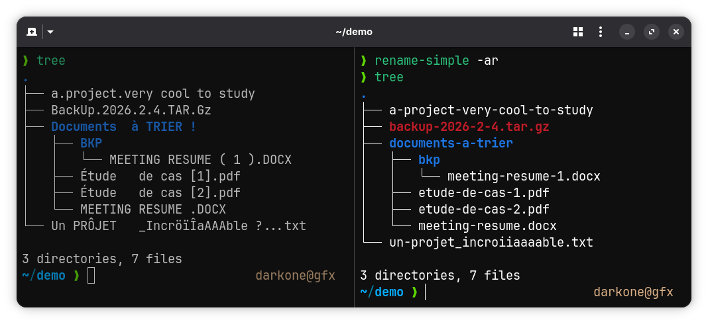

# rename-simple

[](https://github.com/darkone-linux/rename-simple/actions/workflows/ci.yml)
[](https://rust-lang.org)
[](https://crates.io/crates/rename-simple)
[](./LICENSE)

A small Rust CLI tool that renames files and directories to clean, ASCII-safe slugs.



## What it does

- Transliterates accented and extended Latin characters to ASCII (`é → e`, `ç → c`, `œ → oe`, `ß → ss`…)
- Lowercases everything
- Replaces spaces and special characters with `-`; collapses consecutive separators
- Preserves `_`; cleans up `_-` and `-_` sequences to `_`
- Strips leading and trailing `-` / `_` before the extension
- Preserves known compound extensions (`.tar.gz`, `.tar.bz2`, `.tar.xz`, `.tar.zst`)
- Skips hidden files (`.gitignore`, `.DS_Store`…) and flags naming conflicts

## Installation

Requires [Rust](https://www.rust-lang.org/tools/install) 1.70+.

```bash
cargo install --path .
```

## Usage

```
rename-simple [OPTIONS] [DIR]
```

You must specify one of `-f`, `-d`, or `-a` to select what to rename.
Running `rename-simple` without any option prints this help.

| Option | Description |
|---|---|
| `DIR` | Directory to process (default: current directory) |
| `-f` | Rename files only |
| `-d` | Rename directories only |
| `-a`, `--all` | Rename both files and directories |
| `-r`, `--recursive` | Process subdirectories recursively |
| `-n`, `--dry-run` | Preview renames without touching any file |
| `-v`, `--verbose` | Show details of each rename |
| `-h`, `--help` | Print help |
| `-V`, `--version` | Print version |

## Examples

### Preview all renames (dry-run)

```bash
$ rename-simple -a --dry-run ~/Downloads
```

```
  01_ Introduction au Projet.PDF  →  01-introduction-au-projet.pdf
  Réunion d'équipe (2024).docx    →  reunion-d-equipe-2024.docx
  backup.TAR.GZ                   →  backup.tar.gz
  Café Montréal.jpg               →  cafe-montreal.jpg
```

### Rename files only

```bash
$ rename-simple -f ~/Downloads
```

Directories are left untouched; only files are renamed.

### Rename directories only

```bash
$ rename-simple -d ~/Projects
```

Files are left untouched; only directories are renamed.

### Rename everything

```bash
$ rename-simple -a ~/Downloads
```

### Recursive processing

```bash
$ rename-simple -a --recursive ~/Documents
```

Renames files and directories at every level of the tree.

### Verbose output

```bash
$ rename-simple -a -v ~/Downloads
```

```
Directory: /home/user/Downloads

  01_ Introduction au Projet.PDF  →  01-introduction-au-projet.pdf
  Réunion d'équipe (2024).docx    →  reunion-d-equipe-2024.docx
  Café Montreal.jpg               →  cafe-montreal.jpg

3 entry/entries renamed, 0 error(s).
```

## Running the tests

```bash
cargo test
```

## License

MIT
